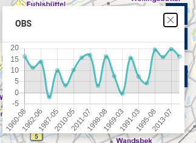

# Addons

Mittels eines Addons lässt sich die Funktionalität des Masterportals beliebig erweitern, ohne dass der **Core** verändert werden muss. Es lassen sich eigenständige `Tools` und `GfiThemes` entwickeln, die zu Beginn der Laufzeit importiert werden und fortan wie eigenständige Module funktionieren. Desweiteren gibt es die Typen `javascript` und `searchInterface`: Mit ersteren Typ lässt sich beliebiger Code hinzufügen, der beispielsweise als Action aufgerufern werden kann - aber bewusst kein Toll sein soll. Mit dem Typ `searchInterface` lassen sich benutzerdefinierte Suchbackends hinzufügen.

Es empfiehlt sich, die  [Vue.js devtools](https://github.com/vuejs/devtools) zu installieren. Diese bieten u.a. einen Live-Zugriff auf den Store.  

Im Rahmen dieses Workshops sollen exemplarisch ein custom GFITheme Addon und ein Javascript Addon eingebunden und konfiguriert werden.  

## Addon-Code
- https://github.com/terrestris/masterportal-addons/tree/main/simpleLineChart
- https://github.com/terrestris/masterportal-addons/tree/main/tourGuide

<!--  -->

