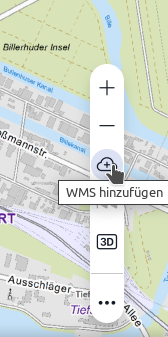

# Portalkonfiguration

## config.js

Hier werden sämtliche Konfigurationen vorgenommen, die nicht direkt auf UI-Elemente oder Layer bezogen sind:

- Pfade zu Backends und weiteren Konfigurationsdateien
- Projektionsdefinitionen im Portal
- Liste an Addons
- Proxy Einstellungen
- Footer
- mousehover

[Link zur vollständigen Dokumentation](https://www.masterportal.org/mkdocs/doc/v3.3.2/User/Portal-Config/config.js/)

**Beispiel-Konfiguration:**

```js
// eslint-disable-next-line no-unused-vars
const Config = {
  addons: ["myAddon"],
  ignoredKeys: ["BOUNDEDBY", "SHAPE", "SHAPE_LENGTH", "SHAPE_AREA", "OBJECTID", "GLOBALID", "GEOMETRY", "SHP", "SHP_AREA", "SHP_LENGTH", "GEOM"],
  namedProjections: [
    // ETRS89 UTM
    ["EPSG:25832", "+title=ETRS89/UTM 32N +proj=utm +zone=32 +ellps=GRS80 +towgs84=0,0,0,0,0,0,0 +units=m +no_defs"],
    // WGS84
    ["EPSG:4326", "+title=WGS 84 (long/lat) +proj=longlat +ellps=WGS84 +datum=WGS84 +no_defs"]
  ],
  layerConf: "https://geodienste.hamburg.de/services-internet.json",
  restConf: "https://geodienste.hamburg.de/lgv-config/rest-services-internet.json",
  styleConf: "https://geodienste.hamburg.de/lgv-config/style_v3.json",
  wfsImgPath: "https://geodienste.hamburg.de/lgv-config/img/",
  portalLanguage: {
    enabled: true,
    debug: false,
    languages: {
      de: "Deutsch",
      en: "English",
      es: "Español",
      it: "Italiano",
      platt: "Platt",
      pt: "Português",
      ru: "Русский",
      tr: "Türkçe",
      ua: "Українська"
    },
    fallbackLanguage: "de",
    changeLanguageOnStartWhen: ["querystring", "localStorage", "htmlTag"]
  }
};
```

## config.json

Die `config.json` enthält die gesamte Konfiguration der Portal-Oberfläche. In ihr wird definiert, welche Elemente sich wo in der Menüleiste befinden, wo das initiale Kartenzentrum liegen soll und welche Layer geladen werden sollen. Des weiteren wird die Liste der Tools und Addons definiert und die dazugehörige Start-Konfiguration festgelegt.

**Version 3:** Hier gab es einige Änderungen, da das Menü anders aufgebaut ist und folglich anders konfiguriert wird.

### portalConfig

* Schaltflächen auf der Kartenansicht sowie mögliche Interaktionen (controls)
* Informationsabfrage von Layern (getFeatureInfo)
* Menüeinträge jeweiliger Tools und deren Reihenfolge (menu)
* Starteinstellungen der Kartenansicht (mapView)
  * Background-Image
* Einträge im Zweit-Menü sowie Reihenfolge (secondaryMenu)
* Titel & Logo (portalTitle)
* Layer/Themenauswahl (tree)
* PortalFooter
  * Liste von Urls
  * Maßstabsleiste

#### Neu in v3 ✨

##### Schnell aufrufbare Tools in der Control-Leiste:

[](./img/startModule.png)

Startmodul innerhalb der controls-Defintion:

```json
"controls": {
  "startModule": {
    "secondaryMenu": [
      {
        "type": "addWMS"
      }
    ]
  }
}
```

##### expandable

Mit *expandable* sind die Bedienelemente hinter einem Button mit drei Punkten versteckt und können bei Bedarf aufgeklappt werden:

```json
"controls": {
  "backForward": true,
  "fullScreen": true,
  "expandable": {
    "button3d": true
  }
}
```

##### openConfig

Konfiguration zur Laufzeit laden:

```json
{
  "icon": "bi-upload",
  "name": "common:modules.openConfig.name",
  "type": "openConfig"
}
```

#### Sections

Untergliederung der Module in den Menüs nach sections. Trennung durch eine horizontale Linie.

---

Beispiel aus der `basic` Portalkonfiguration:

```json
{
  "portalConfig": {
    "map": {
      "controls": {
        "zoom": true,
        "orientation": {
          "zoomMode": "once"
        }
      },
      "mapView": {
        "backgroundImage": "./resources/img/backgroundCanvas.jpeg",
        "startCenter": [
          561210,
          5932600
        ],
        "extent": [
          510000.0,
          5850000.0,
          625000.4,
          6000000.0
        ],
        "startZoomLevel": 1
      }
    },
    "portalFooter": {
      "urls": [
        {
          "bezeichnung": "common:modules.portalFooter.designation",
          "url": "https://geoinfo.hamburg.de/",
          "alias": "Landesbetrieb Geoinformation und Vermessung",
          "alias_mobil": "LGV"
        }
      ]
    },
    "tree": {
      "highlightedFeatures": {
        "active": true
      }
    },
    "mainMenu": {
      "expanded": true,
      "title": {
        "text": "Basic",
        "logo": "./resources/img/mp_logo.png",
        "link": "https://masterportal.org",
        "toolTip": "Masterportal"
      },
      "searchBar": {
        "searchInterfaces": [
          {
            "type": "komootPhoton",
            "minChars": 3,
            "serviceId": "11",
            "limit": 10,
            "lang": "de",
            "lat": 53.6,
            "lon": 10.0,
            "bbox": "9.6,53.3,10.4,53.8"
          },
          {
            "type": "visibleVector",
            "resultEvents": {
              "onClick": [
                "openGetFeatureInfo",
                "setMarker",
                "zoomToResult"
              ],
              "onHover": [
                "setMarker"
              ]
            }
          },
          {
            "type": "topicTree",
            "hitTemplate": "layer"
          }
        ]
      },
      "sections": [
        [
          {
            "type": "fileImport"
          },
          {
            "type": "openConfig"
          },
          {
            "type": "contact",
            "serviceId": "80001",
            "includeSystemInfo": true,
            "from": [
              {
                "email": "lgvgeoportal-hilfe@gv.hamburg.de",
                "name": "LGVGeoportalHilfe"
              }
            ],
            "to": [
              {
                "email": "lgvgeoportal-hilfe@gv.hamburg.de",
                "name": "LGVGeoportalHilfe"
              }
            ]
          },
          {
            "type": "language"
          }
        ]
      ]
    },
    "secondaryMenu": {
      "expanded": false,
      "sections": [
        [
          {
            "type": "wfst",
            "name": "WFS-T Tool",
            "layerIds": [
              "lgvline",
              "lgvpoint",
              "lgvpolygon"
            ],
            "toggleLayer": false,
            "lineButton": [
              {
                "layerId": "lgvline",
                "available": true
              }
            ],
            "pointButton": [
              {
                "layerId": "lgvpoint",
                "available": true
              }
            ],
            "polygonButton": [
              {
                "layerId": "lgvpolygon",
                "available": true
              }
            ],
            "update": "Bearbeiten!",
            "delete": true
          },
          {
            "type": "legend"
          },
          {
            "type": "scaleSwitcher"
          },
          {
            "type": "shareView"
          },
          {
            "type": "measure"
          },
          {
            "type": "coordToolkit",
            "heightLayerId": "19173",
            "heightElementName": "value_0",
            "heightValueWater": "-20",
            "heightValueBuilding": "200",
            "zoomLevel": 5
          },
          {
            "type": "bufferAnalysis"
          },
          {
            "type": "layerSlider",
            "layerIds": [
              {
                "title": "common:modules.layerSlider.serviceOne",
                "layerId": "19173"
              },
              {
                "title": "common:modules.layerSlider.serviceTwo",
                "layerId": "2426"
              },
              {
                "title": "common:modules.layerSlider.serviceThree",
                "layerId": "8712.2"
              },
              {
                "title": "common:modules.layerSlider.serviceFour",
                "layerId": "1711"
              }
            ]
          },
          {
            "type": "layerClusterToggler",
            "layerIdList": [
              "8712.1",
              "8712.2",
              "8712.3",
              "8712.4"
            ]
          }
        ]
      ]
    }
  },
  "layerConfig": {
    "baselayer": {
      "elements": [
        {
          "id": "453",
          "visibility": true
        },
        {
          "id": "452"
        },
        {
          "id": [
            "717",
            "718",
            "719",
            "720",
            "13712",
            "13709",
            "13714",
            "13716"
          ],
          "name": "Geobasiskarten (farbig)"
        },
        {
          "id": "topplus_wmts",
          "name": "TopPlusOpen (WMTS)",
          "typ": "WMTS",
          "visibility": false,
          "showInLayerTree": true
        }
      ]
    },
    "subjectlayer": {
      "elements": [
        {
          "id": [ "3302", "4561"],
          "name": "WMS-Gruppe Trinkwasser und Eventlotse (min-/maxScale 1:1.000 - 1:10.000)",
          "typ": "GROUP",
          "visibility": true,
          "showInLayerTree": true
        },
        {
          "id": "lgvline",
          "name": "wfst_linie_test",
          "visibility": false,
          "typ": "WFS"
        },
        {
          "id": "lgvpoint",
          "name": "wfst_punkt_test",
          "visibility": false,
          "typ": "WFS"
        },
        {
          "id": "lgvpolygon",
          "name": "wfst_polygon_test",
          "visibility": false,
          "typ": "WFS"
        },
        {
          "id": "2426",
          "name": "WMS Bezirke",
          "layerAttribution": "<span>Hier Text angeben, der angezeigt wird sobald der Layer sichtbar ist.</span>"
        },
        {
          "id": "2003",
          "name": "WFS Schutzgebiete",
          "styleId": "2003",
          "mouseHoverField": "gebietsname"
        },
        {
          "id": "10882",
          "name": "WFS Bike and Ride Parkplätze",
          "styleId": "10882",
          "clusterDistance": 40,
          "styleGeometryType": [
            "Point"
          ]
        },
        {
          "id": "1711",
          "name": "WFS Krankenhäuser",
          "styleId": "1711",
          "mouseHoverField": "name",
          "searchField": "name"
        },
        {
          "id": "8712",
          "name": "WFS Schulen",
          "styleId": "8712",
          "mouseHoverField": [
            "schulname",
            "kapitelbezeichnung"
          ],
          "searchField": [
            "schulname",
            "fremdsprache"
          ]
        },
        {
          "id": "4560",
          "name": "WFS Polygon (Default Style)"
        },
        {
          "id": "1132",
          "name": "WFS Point (Default Style)"
        },
        {
          "id": "1133",
          "name": "WFS Line (Default Style)"
        },
        {
          "id": "18105",
          "name": "STA Anzahl frei verfügbarer Fahrräder je StadtRad-Station"
        },
        {
          "id": "8712.1",
          "styleId": "8712.1",
          "name": "Grundschulen",
          "wfsFilter": "resources/xml/schulstandort.staatlich.5.grundschulen.xml",
          "typ": "WFS",
          "visibility": false,
          "clusterDistance": 60,
          "mouseHoverField": [
            "schulname",
            "kapitelbezeichnung"
          ],
          "showInLayerTree": true
        },
        {
          "id": "8712.2",
          "styleId": "8712.2",
          "name": "Stadtteilschulen",
          "wfsFilter": "resources/xml/schulstandort.staatlich.5.stadtteilschulen.xml",
          "typ": "WFS",
          "visibility": false,
          "clusterDistance": 60,
          "mouseHoverField": [
            "schulname",
            "kapitelbezeichnung"
          ],
          "showInLayerTree": true
        },
        {
          "id": "8712.3",
          "styleId": "8712.3",
          "name": "Gymnasien",
          "wfsFilter": "resources/xml/schulstandort.staatlich.5.gymnasien.xml",
          "typ": "WFS",
          "visibility": false,
          "clusterDistance": 60,
          "mouseHoverField": [
            "schulname",
            "kapitelbezeichnung"
          ]
        },
        {
          "id": "8712.4",
          "styleId": "8712.4",
          "name": "Sonderschulen",
          "wfsFilter": "resources/xml/schulstandort.staatlich.5.sonderschulen.xml",
          "typ": "WFS",
          "visibility": false,
          "clusterDistance": 60,
          "mouseHoverField": [
            "schulname",
            "kapitelbezeichnung"
          ]
        }
      ]
    }
  }
}

```

### layerConfig

Die layerConfig definiert, welche Inhalte an welcher Stelle im Themenbaum vorkommen.  
Die Struktur ist abhängig von der Art des Themenbaums (ob flache Hierachie oder Aufsplittung on Fach- und Hintergrundkarten).  
Zudem können mehrdimensionale Daten (Time und 3D) separat definiert werden.

Ein Minimal-Beispiel:

```json
{
  "layerConfig": {
    "baselayer": {
      "elements": [
        {
          "id": "452"
        },
        {
          "id": "432"
        }
      ]
    },
    "subjectlayer": {
      "elements": [
        {
          "name": "My Folder",
          "type": "folder",
          "elements": [
            {
              "id": "10882"
            },
            {
              "id": "10883"
            }
          ]
        }
      ]
    }
  }
}
```

[Link zur vollständigen Dokumentation](https://www.masterportal.org/mkdocs/doc/v3.3.2/User/Portal-Config/config.json/)
