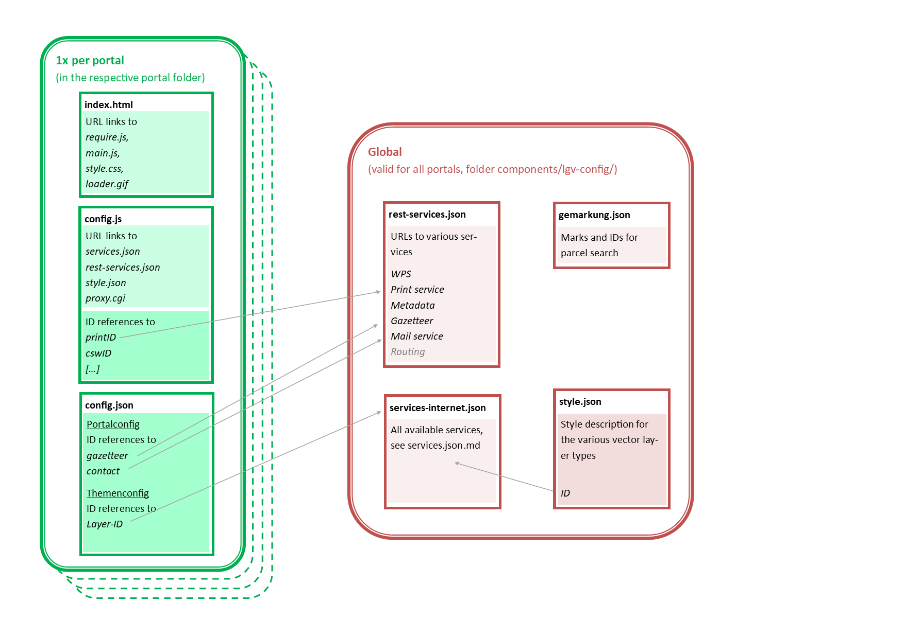

# Konfiguration

Der **Applikationskontext** teilt sich in mehrere Dateien auf, die nach Belieben angepasst werden können. Teilweise können diese automatisch erstellt werden.

**Neu in v3:** Dynamisches Laden einer Portalkonfiguration zur Laufzeit. Modul: `OpenConfig`

