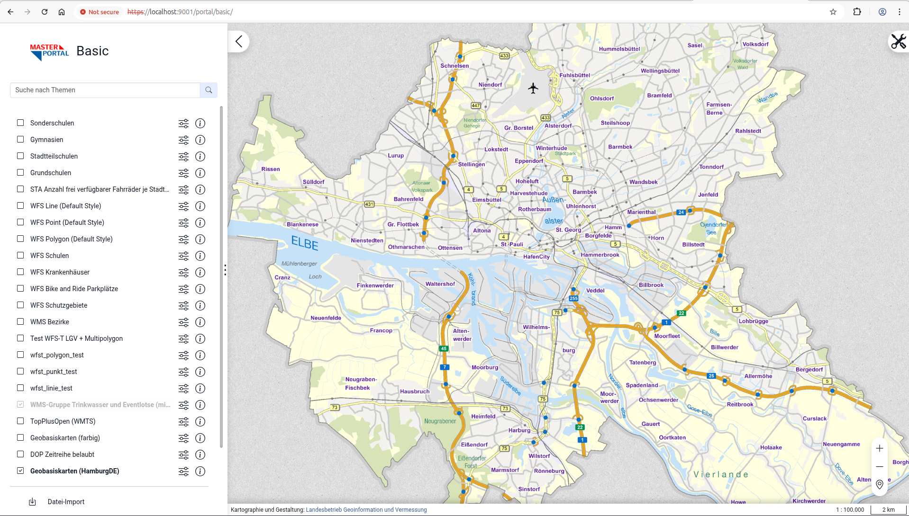

## Repository und Entwicklungssetup 👨‍💻

- Öffnen Sie das Terminal und führen Sie den Befehl `pwd` aus.
- Sie sollten sich im Pfad `/home/user` befinden.
- Führen Sie den Befehl `git clone https://geowerkstatt@bitbucket.org/geowerkstatt-hamburg/masterportal.git` aus, um das Masterportal Repository auf Ihre Festplatte zu kopieren. Navigieren Sie anschließend in das neue Verzeichnis per Befehl: `cd masterportal`.

Wie in vielen modernen Javascript Projekte, wird auch für das Masterportal das [Node.js](https://github.com/nodejs/node) Framework zur Entwicklung genutzt. Mithilfe des Paketsmanager [npm](https://www.npmjs.com/) werden sämtliche Bibliotheken und Abhängigkeiten gemanaged und installiert, wie beispielsweise [webpack](https://github.com/webpack/webpack), der als *module bundler* fungiert.

Eine ausführliche Beschreibung dieser Entwicklungstools- und Frameworks würde den Rahmen dieses Workshops sprengen, die benötigsten Infos werden im Rahmen dieses Workshops gegeben. Eine kurzen Überblick über npm ist [hier](../basics/npm.md) zu finden.

- Führen Sie `node -v`, um die installierte Version von `node` auszugeben.
Falls `node` nicht installiert ist, oder die Version nicht `22.19.0` entspricht, folgende Schritte ausführen:
    - `wget -qO- https://raw.githubusercontent.com/nvm-sh/nvm/v0.40.0/install.sh | bash`
    - Terminal Fenster schließen und erneut öffnen.
    - `nvm install v22.19.0`
    
    
- Es soll auf der Masterportal Version `3.15.2` gearbeitet werden, hierzu sind folgend Befehle auszuführen:
    - `git fetch origin`
    - `git checkout v3.15.2`

- Installieren Sie alle benötigten Abhängigkeiten des Masterportals-Projekts: `npm ci`.

- Starten Sie anschließend den Entwicklungsserver: `npm run start`.

- Nun wird der Masterportal-Quellcode kompiliert und `webpack` erstellt den *dev build*, der anschließend - sobald die Nachricht `Compiled successfully` im Terminal erscheint, im Browser unter der Adresse `https://localhost:9001/portal/basic` aufgerufen werden kann.

- Möglicherweise tauchen viele Logs mit der Nachricht `ENOSPC: System limit for number of file watchers reached` auf. In diesem Fall `Strg+C` drücken um den Dev-Server zu stoppen. Dann `echo fs.inotify.max_user_watches=524288 | sudo tee -a /etc/sysctl.conf && sudo sysctl -p` ausführen und anschließend den Dev-Server wieder starten mit `npm run start`.
   
- Im Browser wird potenziell eine Warnung bezüglich eines unsicheren Zertifikats angezeigt. Dies liegt daran, dass der Entwicklungsserver ein selbstsigniertes Zertifikat nutzt. Klicken Sie auf `Erweitert` und anschließend auf `Risiko akzeptieren und fortfahren`, um die Seite trotzdem zu laden.

> ℹ️  
> Weiterführende Infos:  
> https://bitbucket.org/geowerkstatt-hamburg/masterportal/src/lts/docs/Dev/
