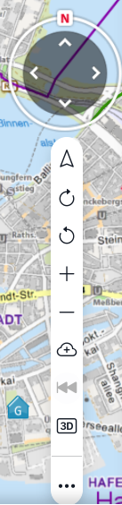
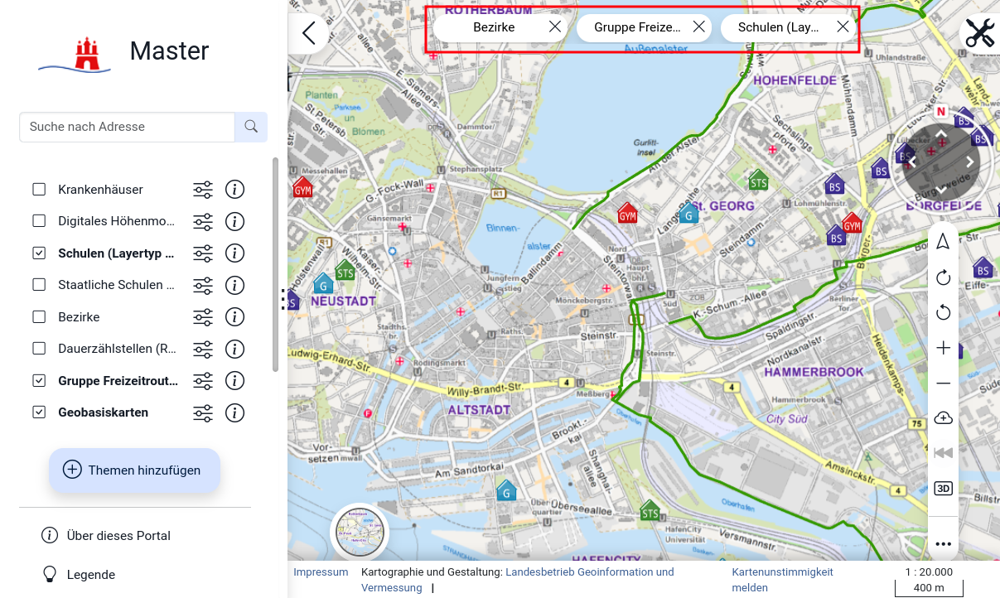
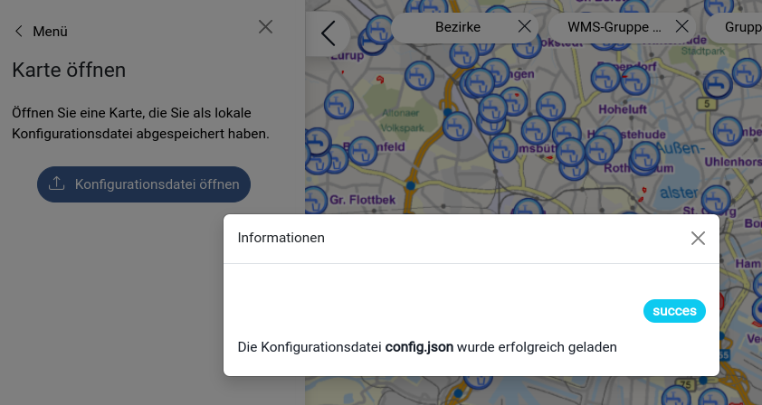
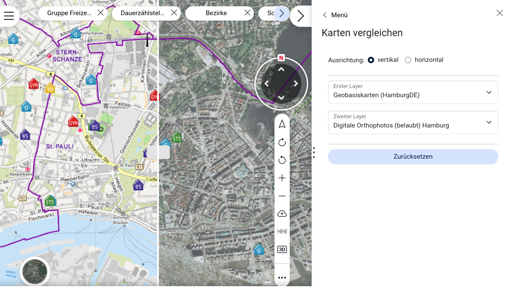
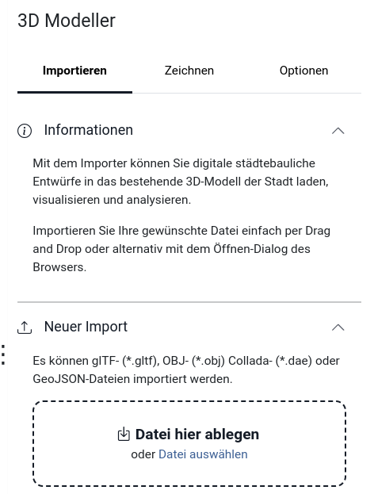
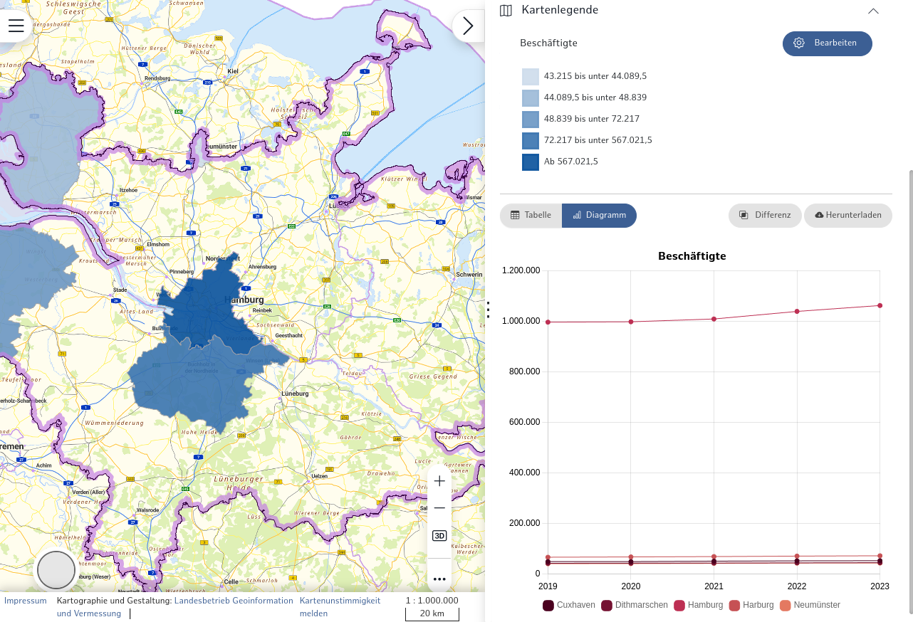

# Ausgangslage 2021

- 7 Jahre altes Projekt
- Code historisch gewachsen, etwas unübersichtlich
- Fokus auf Weiterentwicklung und ein funktionierendes System
  - Bibliotheken Aktualität von "grün auf gelb auf rot"
- Organisation und Prozesse sind professionalisiert worden
- Anspruch an Code gewachsen, technische Schulden werden automatisch erkannt und adressiert
  
# Version 3

- Menü Modul – neue Oberfläche
  - Neuanordnung von Elementen und Layern: `MainMenu` und `SecondaryMenu`
  - GUIs der einzelnen Module unverändert
  - Neue GUI adressiert auch GIS unerfahrene User
- Stärkung der **masterportalAPI**, um Nutzung in anderen Anwendungsgebieten zu ermöglichen
  - z.B. Auslagerung aller Daten-Schnittstellen in die **masterportalAPI**
- Customizable
    - Mehrere Möglichkeiten zur Individualisierung
- Kein Jquery mehr, kein BackboneJS mehr
- Neues UI
    - Entstanden im Rahmen einer größeren Studie/Umfrage
- Vue3 und Vuex
- Bootstrap 5
    - UI Elemente (Buttons, Modals, Forms, Navs und tabs, )
- Performance
    - Refaktorierung Config and Layer Loading
- Responsivity
    - Design/Layout für Tablets und Smartphones optimiert

## Custom Map Controls

Mit den Controls kann festgelegt werden, welche Interaktionen in der Karte möglich sein sollen.

Controls können in der config.json in die Ebene "expandable" verschachtelt werden und sind somit nicht mehr in der Leiste an der Seite, sondern über den Button mit den drei Punkten aufklappbar.

```json
"controls": {
  "rotation":  {
    "showResetRotationAlways": true,
    "showResetRotation": true,
    "rotationIcons": true,
    "moveDistance": 2500,
    "compass2d": true
    } ,
  "zoom": true,
  "tiltView": true,
  "startModule": {
    "secondaryMenu": [
      {
        "type": "addWMS"
      }
    ]
  },
  "totalView": true,
  "button3d": true,
  "expandable": {
    "backForward": true,
    "orientation": {
      "zoomMode": "once",
      "poiDistances": [
        500,
        1000,
        2000
      ]
    },
    "freeze": true,
    "fullScreen": true
  }
}
```

[](img/customControls.png)

## Layer Tree

Die Layer Tree Komponente wurde grundlegend verändert in der Version 3:

Per default gibt es nur eine flache Layerliste, also keinen echten Layer-Tree wie man es aus anderen GIS Systemen gewohnt ist. Der Hintergrund ist, das GIS-Unerfahrene Nutzer nicht überfordert werden sollen (hatten wir beim LGV HH nachgefragt).  
**Neu:** Es gibt den neuen "Layer-Katalog" (`LayerSelection.vue`). Dieser kann über den Parameter `addLayerButton` (`portalConfig.tree`) konfiguriert werden. Hier gibt es die folgenden Wege bzw. Fälle:

1. Fall: `addLayerButton: false`
Es werden alle konfigurierten Layer in der flachen Layerliste angezeigt.

2. Fall: `addLayerButton: true`
Sämtliche Layer mit den Property `isVisible: true` oder `showInLayerTree: true` landen in der flachen Layerliste.  
Layer, die initial nicht sichtbar sind (`isVisible: false`), aber in der `config.json` referenziert werden, können über den Layerkatalog hinzugefügt werden.

3. Fall: `addLayerButton: true` und `treeType: "auto"`
Es werden alle Layer im Katalog angeboten, die in der `services.json` definiert sind, strukturiert durch ihre Metadaten. Dies ist die sogenannte "Geo-Online" Lösung die bspw. im Geoportal Hamburg Anwendung findet.

## LayerPills

Layerpills sind Buttons, die oberhalb der Karte die ausgewählten Layer anzeigen. Beim Anklicken einer LayerPill, werden die entsprechenden Layerinformationen im Menü angezeigt. Dies kann auch nur für den mobile-mode (`mobileOnly: true`) aktiviert werden.

[](img/layerpills.png)

## Tool openConfig

Mit diesem Modul lässt sich eine Konfigurationsdatei (config.json) zur Laufzeit neu laden. Die Module und Karte werden an die neue Konfiguration angepasst.

[](img/openConfig.png)

## compareMaps

Dieses Tool ermöglicht es Benutzern, zwei Layer nebeneinander mit einem Layer-Swiper zu vergleichen. Benutzer wählen Layer aus den aktiven, sichtbaren Layern aus, und der Swiper teilt die Karte, um jeden Layer in separaten Abschnitten anzuzeigen. Das Tool unterstützt WMS- und WFS-Layer und stellt sicher, dass die Layer vollständig aktualisiert werden, bevor der Swiper bewegt wird, um einen genauen Vergleich zu ermöglichen.

[](img/compareMaps.png)

## About

Mit diesem Modul lassen sich spezifische Portalinformationen anzeigen wie z.B. Beschreibungstext, Masterportalversion, Metadaten.

**Ausgewählte Parameter:** ([vollständige Liste](https://www.masterportal.org/mkdocs/doc/v3.2.0/User/Portal-Config/config.json/#portalconfigmenusectionsmodulesabout))

- `abstractText`: Beschreibungstext des Portals
- `contact`: Metadaten Kontaktinformationen
- `logoLink`: Link des Logos
- `metaId`: Id des Metadateneintrages
- `metaUrl`: URL des Metadateneintrages
- `version`: Versionangabe des Masterportals
- `privacyStatementText`: Text für den Datenschutzabschnitt
- `accessibilityText`: Text für den Barrierefreiheitsabschnitt

## Weitere neue Module

- News
- baseLayerSwitcher
- CustomMenuElement

## 3D

- Code refactoring
- Print 3D
- Modul: Modeler3D
    - Talk 3DProjektplaner – Stadtentwicklung mit Perspektive: https://pretalx.com/fossgis2024/talk/93LW77/

[](img/3dmodeler.png)

## StatisticDashboard

Funktionserweiterung in v3, u.a.:
    - Lesen von OGG API Features Quellen
    - Validierung
    - Erweiterung der Konfiguration
    - Button für CSV Export


[](img/statisticDashboard.png)

Siehe exemplarische Umsetzung im MRH Portal: https://geoportal.metropolregion.hamburg.de/mrhportal/index.html

## Release Schedule

[](./img/Masterportal-TimeSchedule.svg)
