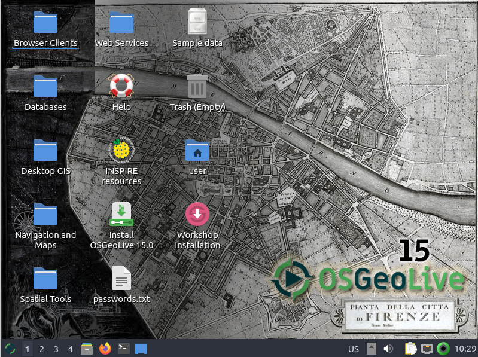

# Vorarbeitung und generelle Informationen

Bevor wir mit dem Workshop starten können, führen Sie bitte die folgenden Schritte
aus:

* Rechner mit OSGeoLive-Medium hochfahren

Es wird angenommen, dass die OSGeoLive bereits installiert ist. Falls nicht, kann der Live-Modus gestartet werden:

* *Lubuntu ohne Installation ausprobieren* auswählen
* Benutzer: user; Passwort: user (wird vermutlich nicht benötigt)

> **Warning**
>
> :warning:
> Sollte die Tastaturbelegung noch auf **US** gestellt sein (siehe unten rechts in der Taskleiste), öffnen Sie ein Terminal (`Strg+T`)
> und führen Sie folgenen Befehl aus: `setxkbmap -layout de`
    

