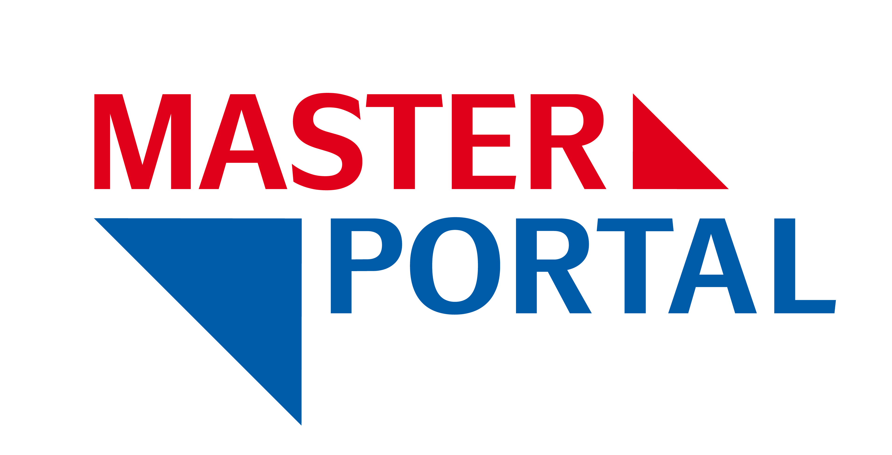

# Einführung ins Masterportal

Herzlich Willkommen beim **Mastering the Masterportal** Workshop. :wave:

Dieser Workshop wurde für die Verwendung auf der [OSGeo-Live {{ book.osGeoLiveVersion }} DVD](https://live.osgeo.org) entwickelt und soll Ihnen einen umfassenden Überblick über das Open Source Masterportal als Web-GIS-Lösung geben.

<!-- > **Info**
>
> Der Workshop kann [hier als PDF-Version]({{ book.workshopPdfUrlDe }}) heruntergeladen werden. -->

# Allgemeines

Das Masterportal Projekt ermöglicht die Erstellung modularer und somit individueller Geoportale. Zum Aufbau einer Nutzer- und Entwicklungsgemeinschaft wurde die Implementierungsgemeinschaft ins Leben gerufen, die mittlerweile aus über 30 Partnern auf kommunaler, förderaler und Bundesebene besteht. Die wichtigsten Vernetzungs- und Entscheidungstreffen sind:

* Strategisches Kommittee (steuert und kontroliert die strategische Richtung des Masterportals)
* Technisches Kommittee (unterstützt das Strategische Kommittee in technischen Fragen)
* Produktpflege (Technische Weiterentwicklung, Release Management, etc.)
* Maintainergroup (unterstützt die Produktpflege bei der technischen Weiterentwicklung, Bearbeitung von PullRequests usw.)
* Produktmanagement (koordiniert organisatorische Angelegenheiten, Öffentlichkeitsarbeit, Veranstaltungsplanung usw.)

Neben den regelmäßig stattfindenden Gremiensitzungen werden verschiedene Workshops organisiert, zum Beispiel zur Ersteinrichtung der Software oder zu speziellen technischen Themen wie der Integration von sicheren Geodatendiensten.

Neben den Partnern aus der öffentlichen Verwaltung gibt es verschiedene Unternehmen, die Support und Wartung anbieten und zur Weiterentwicklung von Masterportal beitragen.

## Zentrale Links:

* [Website](https://www.masterportal.org/)
* [Twitter](https://twitter.com/masterportalorg)
* [Code](https://bitbucket.org/geowerkstatt-hamburg/masterportal/)

# Autoren


  - {{ author.name }} ([{{ author.mail }}](mailto:{{ author.mail }}))


# Zuarbeit

- LGV HH, u.a. Dirk Rohrmoser ([dirk.rohrmoser@gv.hamburg.de](mailto::dirk.rohrmoser@gv.hamburg.de))
- Marc Jansen (COG Example) ([jansen@terrestris.de](mailto:jansen@terrestris.de))
