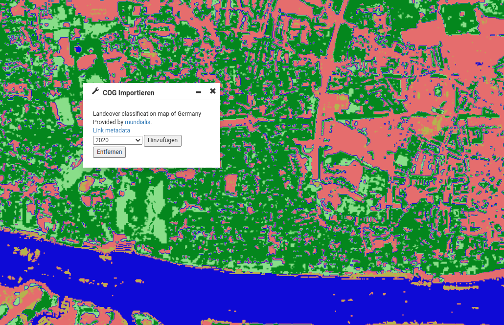

# Addon Konfiguration

Ein Addon muss an zwei Stellen im Masterportal konfiguriert werden.

## 1. config.js

- Fügen Sie an beliebiger Stelle das folgende Property hinzu:

```
    addons: ["cogImporter"],
```

## 2. config.json

Fügen Sie im Block `tools` -> `children` den folgenden Block hinzu:

```
          "cogImporter": {
            "name": "translate#additional:modules.tools.cogImporter.title",
            "glyphicon": "glyphicon-wrench"
          }
```

Nun ist das Addon fertig eingebunden. :exclamation: Bitte beachten Sie, dass dies keinesfalls für eine Produktiv-Anwendung gedacht ist, es dient lediglich der Demonstration.  

:question: Was fehlt: :
- Dokumentation
- Code Dokumentation
- Tests
- Konfigurierbarkeit (welche COG können eingebunden werden)
- Hinzufügen der Layer in den Tree
- ...




