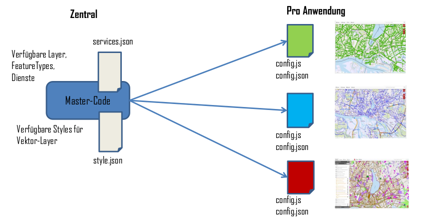

# Konfiguration

Der Applikationskontext teilt sich in mehrere Dateien auf, die nach Belieben angepasst werden können. Teilweise können diese automatisch erstellt werden, darauf wird im nächsten Kapitel eingegangen.

