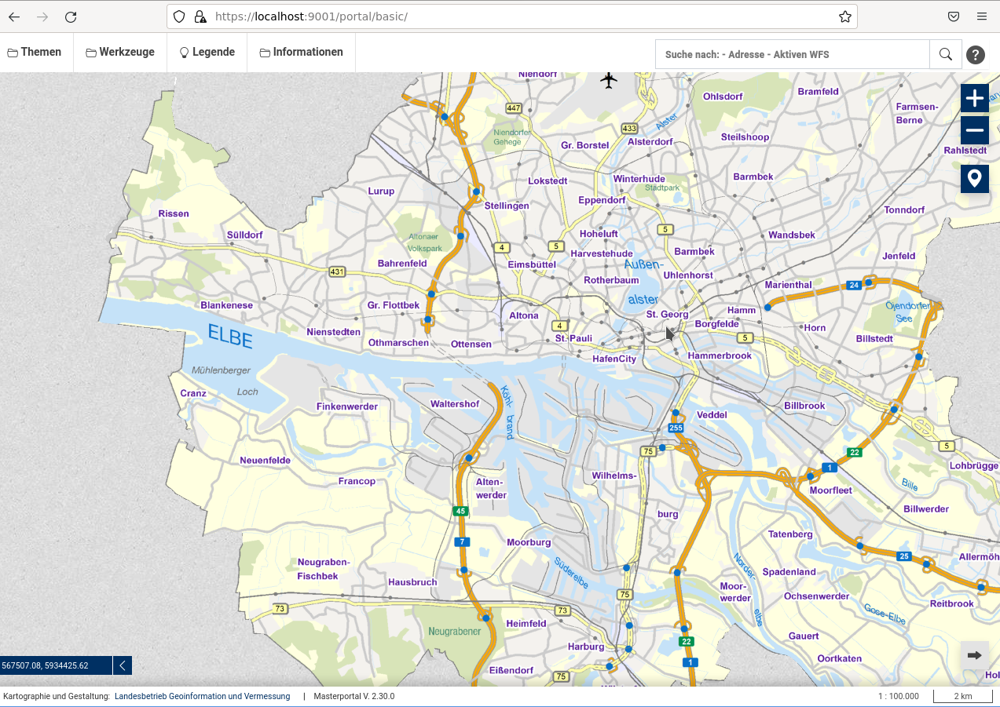

## Repository und Entwicklungssetup 👨‍💻

1. Öffnen Sie das Terminal und führen Sie den Befehl `pwd` aus.
2. Sie sollten sich im Pfad `/home/user` befinden.
3. Führen Sie den Befehl `git clone https://hblitza@bitbucket.org/geowerkstatt-hamburg/masterportal.git` aus, um das Masterportal Repository auf Ihre Festplatte zu kopieren. Navigieren Sie anschließend in das neue Verzeichnis per Befehl: `cd masterportal`.

Wie in vielen modernen Javascript Projekte, wird auch für das Masterportal ein [Node.js](https://github.com/nodejs/node) Framework zur Entwicklung genutzt. Mithilfe des Paketsmanager [npm](https://www.npmjs.com/) werden sämtliche Bibliotheken und Abhängigkeiten gemanaged und installiert, wie beispielsweise [webpack](https://github.com/webpack/webpack), der als *module bundler* fungiert.

Eine ausführliche Beschreibung dieser Entwicklungstools- und Frameworks würde den Rahmen dieses Workshops sprengen, die benötigsten Infos werden im Rahmen dieses Workshops gegeben. Eine kurzen Überblick über npm ist [hier](../basics/npm.md) zu finden.

1. Führen Sie `node -v`, um die installierte Version von `node` auszugeben.
Falls `node` nicht installiert ist, oder die Version <`16.13.2` oder >`16.18.1` ist, folgende Schritte ausführen: 
    - `wget -qO- https://raw.githubusercontent.com/nvm-sh/nvm/v0.39.3/install.sh | bash`
    - `source ~/.bashrc` Refresh der `.bashrc`. Notwendig, um neues command `nvm` auszuführen
    - `nvm install v16.18.1`
1. Es soll auf der Version `2.31.0` gearbeitet werden, hierzu sind folgend Befehle auszuführen:
    - `git fetch origin`
    - `git checkout v2.31.0`
2. Installieren Sie alle benötigten Abhängigkeiten des Masterportals-Projekts: `npm i`.
3. Starten Sie anschließend den Entwicklungsserver: `npm run start`.
4. Nun wird der Masterportal-Quellcode kompiliert und `webpack` erstellt den *dev build*, der anschließend - sobald die Nachricht `Compiled successfully` im Terminal erscheint, im Browser unter der Adresse `localhost:9001/portal/basic` aufgerufen werden kann.
5. Möglicherweise tauchen viele Logs mit der Nachricht `ENOSPC: System limit for number of file watchers reached` auf. In diesem Fall `Strg+C` drücken um den Dev-Server zu stoppen. Dann `echo fs.inotify.max_user_watches=524288 | sudo tee -a /etc/sysctl.conf && sudo sysctl -p` ausführen und anschließend den Dev-Server wieer starten mit `npm run start`.
   

> ℹ️  
> Weiterführende Infos zum Dev-Setup unter:  
> https://bitbucket.org/geowerkstatt-hamburg/masterportal/src/latest/doc/setup.md

