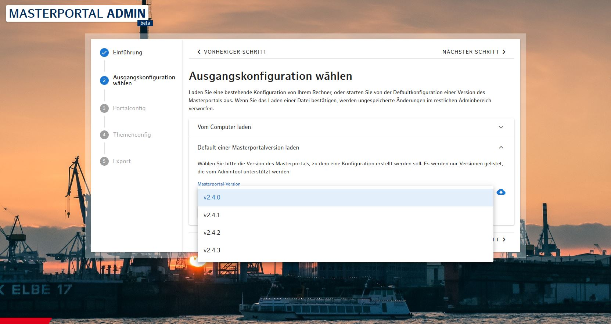

# Masterportal Admin

Mit dem „Masterportal-Admin“ steht interessierten NuterInnen eine webbasierte Anwendung mit grafischer Benutzeroberfläche zur Verfügung, die es ermöglicht, Konfigurationen für individuelle Geoportale dialoggeführt zu erstellen.

* [Kurzbeschreibung](https://www.masterportal.org/masterportal-extras.html)

* [Repository](https://bitbucket.org/geowerkstatt-hamburg/mp-admintool/src/master/)

